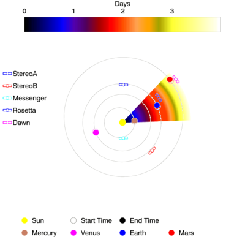

The HELiophysics Integrated Observatory is an e-infrastructure project aimed
to help heliophysics researchers to discover new datasets.

My roles in this project were:

- liasing between scientists and developers,
- implement feature detection codes into the gridIreland
- test [event][hec] and [feature][hfc] catalogues
- help in the design of services (eg. [Unified Observing Catalogue][UOC])
- create [workflows][helio_workflows] using [Taverna][taverna]
- create a heliospheric propagation model: [SHEBA][SHEBA] ([source code][sheba_src])
- disemminate and provide training
 - [screen cast][yt_helio]
 - Talk at STEREO meeting
 - Talk at SIPWork (Switz)
 - Talk at SIPwork (Montana)
 - Talk at Summer School (Armagh)
 - Talk at Slovakia
 - Talk at FMI
- Organise Coordinated Data Analysis Workshop (Science and Local committee)
 - CDAW 0
 - CDAW 3
- Publications ([ADS][ads_helio], [GoogleScholar][scholar_helio])
 - [Studying Sun-Planet Connections Using the Heliophysics Integrated Observatory][doi_helio1] - OA

 
Funding of the project ended at the end of 2012, however the interfaces
are stil alive and maintain.

  

[hec]: http://hec.helio-vo.eu
[hfc]: http://hfc.helio-vo.eu
[uoc]: http://helio-vo.eu/services/interfaces/helio-uoc_uix.php
[helio_workflows]: http://www.myexperiment.org/groups/101.html
[taverna]: http://www.taverna.org.uk/
[SHEBA]: http://cagnode58.cs.tcd.ie/PropagationModelGUI/
[sheba_src]: https://github.com/dpshelio/sheba/
[yt_helio]: https://www.youtube.com/watch?v=N6IxgPFKOcA
[ads_helio]: https://ui.adsabs.harvard.edu/#search/fq={!type%3Daqp+cache%3Dfalse+cost%3D150+v%3D%24fq_author}&fq_author=%28author_facet_hier%3A%220%2FPerez-Suarez%2C+D%22%29&q=author%3A%22Perez-Suarez%22+HELIO+-sunpy&sort=date+desc
[scholar_helio]: https://scholar.google.co.uk/scholar?start=0&q=author:%22Perez-suarez%22+HELIO&hl=en&as_sdt=0,5
[doi_helio1]: http://dx.doi.org/10.1007/s11207-012-0110-x
